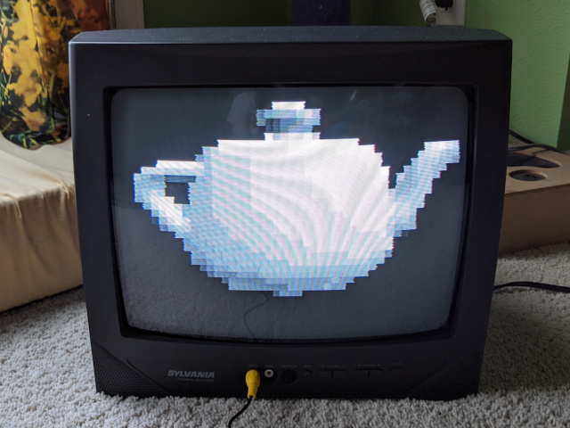
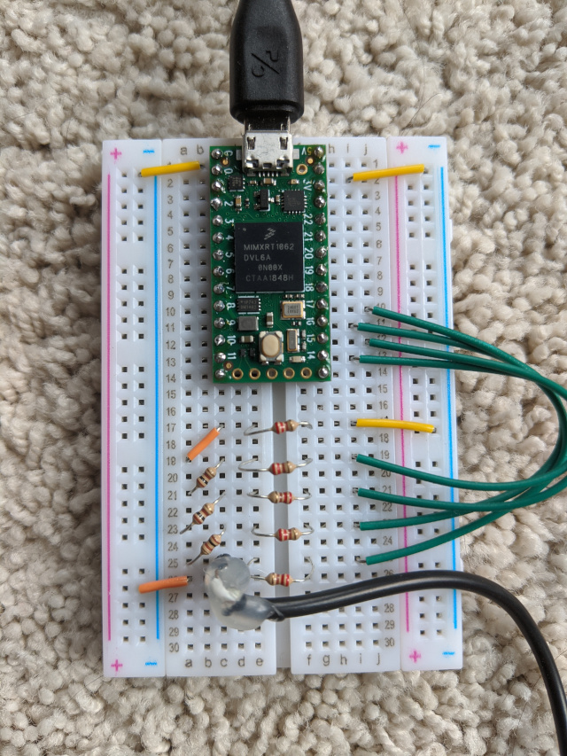
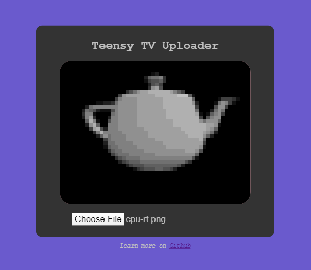

# Teensy TV



Teensy TV is an experiment in driving component NTSC video from a Teensy 4.0.

Teensy TV is currently comprised of two parts: Arduino source code running on a Teensy 4.0, and a Node.js server that sends data to the Teensy. The Teensy acts as a RawHID USB device so we can send 64-byte packets to it. Each packet progressively updates the screen buffer, which is 52 wide x 39 tall x 15 shades of gray (4 bit).

## Hardware



Pins 14-17 are combined using an R2R resistor ladder in order to output a 4-bit 1.25V signal to a composite video plug. A value of 0x0 is used for HSync and VSync pulses, so 0x1 is the color black, and 0xF is white.

## Software setup

### Teensy code

The source code takes advantage of the `elapsedMicros` type by measuring a variable in a while(1) loop in order to achieve microsecond precision. This will be insufficient in the long run, but for low-res grayscale a stable image can be achieved. The Teensy runs through a loop that steps through the different components that make up an NTSC frame, and updates pin states to set the voltage on the cable.

At the start of each frame, the Teensy checks for incoming packets on the USB bus. If packets have arrived, it updates the screen buffer with their data. Then the drawing process starts for the next frame, and the image is updated.

When updating the Teensy's firmware, the USB Type in the Tools menu must be set to "Raw HID". Otherwise the device will not be able to receive the raw USB packets we send it.

## Web interface



```shell
  cd web
  yarn
  yarn start
```

This will begin the server at `localhost:3000`. The Node server both hosts a webpage at this address, and passes POSTs to `localhost:3000/tv` to the Teensy. If the Teensy is not detected, the Node server will log the problem to the console.

## References

[How to generate Color video signals in software using SX chips](https://elinux.org/images/e/eb/Howtocolor.pdf)

[ESP32 Composite Video](https://bitluni.net/esp32-composite-video)

[Analog Video Vertical Sync](https://www.youtube.com/watch?v=NY2rIjkH1Xw)

[HID control of a web page](https://learn.sparkfun.com/tutorials/hid-control-of-a-web-page/all)

Numerous posts at [forum.pjrc.com](https://forum.pjrc.com/)